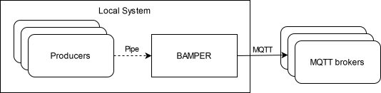

= PIMPER
:toc:
A PIpe-based Message PublishER.

== TL;DR
**What?** Publish output of one or more programs to an MQTT broker using a single, persistent connection.

**How?** Start a PIMPER container and let producers write lines containing topic and message to a named pipe.

**Why?** Add MQTT support to any program while preserving network resources carefully.

== Overview
This project is a Gateway between programs that write to stdout/stderr and the MQTT world.

The well-known tool `mosquitto_pub` is able to do this job, but with one drawback:
it requires one connection per topic (https://github.com/eclipse/mosquitto/issues/3060[mosquitto #3060]).
Programs that output to different topics can be covered by calling `mosquitto_pub` once per message,
resulting in heavy resource use for busy producers (1 DNS lookup + 1 TCP connection + maybe 1 TLS handshake per message).

PIMPER is able to publish output from one or more programs over a single, persistent MQTT connection.



=== Communication via pipes
A producer's output must reach PIMPER somehow.
In a containerized world, applications usually communicate over the network.
The main purpose of this project is avoidance of network overhead, so this would be no good fit here.

Thus, producers send messages through a pipe in the file system.
PIMPER comes with a default pipe that producers can use.
It is also possible to configure one or more pipes manually.

NOTE: A pipe is not 1:1 but n:m, so multiple producers can use the same pipe.


== Usage
=== Setup
Setup is easy: start a PIMPER container and redirect producers' output to the source pipe.

==== Example: Simple configuration for a containerized producer
Run `docker compose up` with this configuration to

. Start PIMPER in a container
. Export its default pipe in a volume
. Start a demo producer in another container

.compose.yml
```yaml
---
services:
  pimper:
    image: ghcr.io/git-developer/pimper
    command:
      - 'mqtt://broker?clientId=demo-producer'
    volumes:
      - 'sources:/var/run/pimper'

  producer:
    image: busybox
    volumes:
      - 'sources:/var/run/pimper'
    command:
      - sh
      - '-c'
      - |
        while true; do
          printf '%s %s\n' pimper/demo/date "$(date)"
          sleep 2
        done >>/var/run/pimper/source
    depends_on:
      pimper:
        condition:
          service_healthy
 
volumes:
  sources:
```

==== Example: Separate configurations for a containerized producer
Producers do not need to be declared within the same Compose configuration as PIMPER.
To redirect messages from other containers, just mount the volume into them.

.pimper/compose.yml
```yaml
---
services:
  pimper:
    image: ghcr.io/git-developer/pimper
    command:
      - 'mqtt://broker'
    volumes:
      - 'sources:/var/run/pimper'
volumes:
  sources:
```

.producer/compose.yml
```yaml
---
services:
  producer:
    image: busybox
    volumes:
      - 'pimper_sources:/var/run/pimper'
    command:
      - sh
      - '-c'
      - |
        while true; do
          printf '%s %s\n' pimper/demo/date "$(date)"
          sleep 2
        done >>/var/run/pimper/source
volumes:
  pimper_sources:
    external: true
```

==== Example: Manual setup for a non-containerized producer
It is also possible use a producer that is not running as Docker container.

```sh
# Start a demo subscriber to see messages
$ mosquitto_sub -v -L mqtt://broker/pimper/# &

# Create a pipe
$ mkfifo -m 666 /tmp/pimper-source

# Start PIMPER
$ docker run -d --rm -v /tmp/pimper-source:/var/run/pimper/source ghcr.io/git-developer/pimper mqtt://broker >/dev/null
pimper/status mqttjs_f0212988 is connected

# Publish a few messages
$ for i in 1 2 3; do echo "pimper/demo" "This is demo message ${i}"; sleep 1; done >>/tmp/pimper-source

# This output is coming from mosquitto_sub
pimper/demo This is demo message 1
pimper/demo This is demo message 2
pimper/demo This is demo message 3
pimper/status mqttjs_f0212988 is disconnected (Cause: /var/run/pimper/source was closed)

# Stop demo subscriber
$ pkill mosquitto_sub
[1] + Done                       mosquitto_sub -v -L mqtt://broker/pimper/#
```

== Message Format
Messages are read line-by-line from the source pipe(s). Each line is expected in this format:

_<TOPIC> <SEPARATOR> <PAYLOAD> <NEWLINE>_

Default for the separator is a space character (`⎵`).
The payload may contain space characters.

Examples:
```
sensors/outside/temp 25°C
monitoring/living-room/status No Problems
```

If a producer is unable to output this format, an adapter (e.g. a shell script) can be introduced
to convert the program output before it is written to the PIMPER source pipe.

== Configuration
=== Options
- The only required option is an URL pointing to a target MQTT broker.
- All https://github.com/mqttjs/MQTT.js?tab=readme-ov-file#client[mqttjs options] are supported.

.Main Configuration
[cols="1,2a,1a,4a"]
|===

|Variable|Description|Allowed values|Default
|`sources`|List of sources|_Source_ definitions|
```yaml
  - file: /var/run/pimper/source
```
|`targets`|List of targets|_Target_ definitions|_none_
|`topicSeparator`|Separator between topic and message for all sources|Any string|`⎵` (Space)
|===

[cols="3,4,5a,3,3"]
.Source Definition
|===
|Variable|Description|Allowed values|Default|Example

|`file`|Path of the source in the file system|Path to a readable file|`/var/run/pimper/source`|`/dev/stdin`
|`topicSeparator`|Separator between topic and message for this source|Any string|`topicSeparator` from the main configuration|`:`
|`onClose`
|Behavior when the source file is closed
| * `shutdown`: Shutdown the application
* `reopen`: Reopen the source
* `ignore`: Do nothing
|`shutdown`|`reopen`
|===

[cols="2,2,2,1,3a"]
.Target Definition
|===
|Variable|Description|Allowed values|Default|Example

|`url`|MQTT URL|URL containing at least protocol (`mqtt` or `mqtts`) and broker hostname|None|`mqtt://broker?clientId=demo-client`
|`options`|MQTT options|https://github.com/mqttjs/MQTT.js?tab=readme-ov-file#client[mqttjs options]|None|
```yaml
options:
  clientId: demo-client
```
|`statusTopic`|MQTT topic for status messages. To disable, set to an empty string.|MQTT topic|`pimper/status`|`management/pimper`
|`caFile`|CA certificate|File path|None|`/opt/custom-ca.crt`
|===

=== Syntax
* Configuration can be done via a YAML file and/or command line arguments.
* When both are given, command line arguments have priority over file configuration.
* The default path for the configuration file is `/etc/pimper.yml`.
  It may be overriden via environment variable `PIMPER_CONFIG_PATH`
  (which is quite unusual because you can achieve the same using a volume mapping).
* Command line arguments are expected as key/value pairs.
** Key and value separated by an `=` character without spaces.
** Keys are expected in dotted notation. List items are represented as 0-based index number.
** The key for the URL of the first MQTT broker may be omitted,
   i.e. `targets.0.url=mqtt://broker` is the same as `mqtt://broker`.

[cols="1,3a,3a"]
.Examples
|===
|Description|YAML|Command Line Arguments

|Read from `/pipe`, publish to `broker`
|```yaml
---
sources:
  - file: /pipe
targets:
  - url: "mqtt://broker"
```
|
_none_

|Read from `/pipe`, publish to `broker`
|
_none_
|
```
sources.0.file=/pipe targets.0.url=mqtt://broker
```

|Override broker from YAML with arg
|
```yaml
---
sources:
  - file: /pipe
targets:
  - url: "mqtt://broker"
```
|
```
targets.0.url=mqtt://custom-broker
```

|===

=== YAML Examples
==== Single source, single broker
.pimper.yml
```yaml
---
targets:
  - url: "mqtt://broker"
```

==== MQTT over TLS, custom client id
.pimper.yml
```yaml
---
targets:
  - url: "mqtts://broker"
    caFile: /opt/custom-ca.crt
    options:
      clientId: pimper-tls-demo
```

.compose.yml
```yaml
services:
  pimper:
    volumes:
      - './pimper.yml:/etc/pimper.yml:ro'
      - './custom-ca.crt:/opt/custom-ca.crt:ro'
```

==== Complex use case with multiple sources and targets
.pimper.yml
```yaml
topicSeparator: ':'
sources:
  - file: /dev/stdin
    topicSeparator: ' '
  - file: /var/run/pimper/source
    onClose: reopen
  - file: /tmp/messages
    topicSeparator: ','
    onClose: ignore
targets:
  - url: "mqtt://broker-1?clientId=demo-client"
  - url: "mqtts://broker-2"
    caFile: /opt/ca.crt
    statusTopic: pimper/management
    options:
      clientId: tls-client
```

.compose.yml
```yaml
services:
  pimper:
    volumes:
      - './pimper.yml:/etc/pimper.yml:ro'
      - './custom-ca.crt:/opt/ca.crt:ro'
```

=== Environment Variables
PIMPER uses the https://www.npmjs.com/package/debug[debug] package.
To enable debug messages, include the `pimper` module in the environment variable `DEBUG`. Example:
```yaml
---
services:
  pimper:
    environment:
      DEBUG: 'pimper:*,mqttjs*'
      DEBUG_DEPTH: 5
```

== References
* https://github.com/mqttjs/MQTT.js[MQTT.js] - A client library for the MQTT protocol
* https://mosquitto.org/[Mosquitto] - An Open Source MQTT Broker
